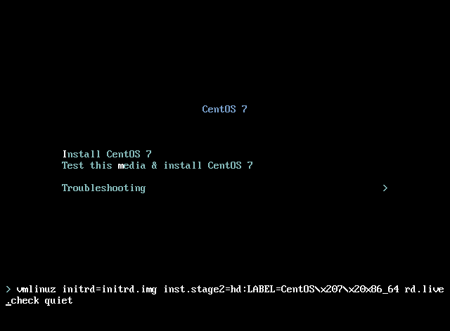
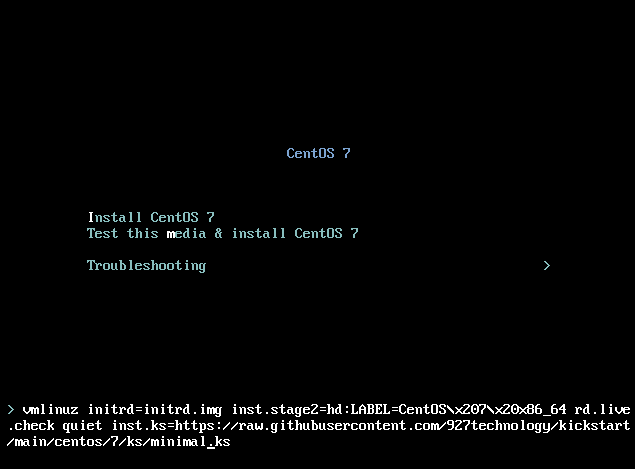

# Deployment


## Install Enterprise Linux (EL) from an internet Kickstart

This is a completely automated install.   

OS Requirements
> 1 or more network interfaces with internet connectivity </br>
> 1 or more processors </br>
> 2048Mb or more memory 

1. You will need bootable media, NetBoot media does not work at this time, any minimal or full media will do.  Boot media is important becuause it defines th OS major version.  The OS detection looks at the OS defined in the initrd and builds based on the major version.  A 9.1 OL will patch to the latest 9.x that is defined by the Distro maintainer.
    * [CentOS](https://www.centos.org/download/)
        * 7 Working
        * 8 Working - Not fully patching
        * 9 Working
    * [Oracle - UEK](https://yum.oracle.com/oracle-linux-isos.html)
        * 7 Working
        * 8 Working - Not fully tested
        * 9 Working
    * [Rocky](https://rockylinux.org/download/)
        * 8 Working
        * 9 Working
1. Boot the install media on a computer or VM that has internet connectivity
1. Interrupt the boot media menu usually by pressing \<TAB\> which will display the boot command
    
1. Append to the end of he boot command
    

    Minimal Install - (All)
    ```
    inst.ks=https://raw.githubusercontent.com/927technology/kickstart/main/distro/el/minimal.ks
    ```   
    
    Docker-CE Install - (All)
    ```
    inst.ks=https://raw.githubusercontent.com/927technology/kickstart/main/distro/el/docker.ks
    ``` 
    
    MySql Install - (All): As Container
    ```
    inst.ks=https://raw.githubusercontent.com/927technology/kickstart/main/distro/el/mysql.ks 
    ```
            Password: ninepassword


    Nessus Install - (All): As Container
    ```
    inst.ks=https://raw.githubusercontent.com/927technology/kickstart/main/distro/el/nessus.ks 
    ```
            URL: https://<ip>:8834
            Username: nineuser        
            Password: ninepassword

    

    The resulting command should look like
    ```
    > vmlinuz initrd=initrd.img inst.stage2=hd:LABEL=CentOS\x207\x20x86_64 rd.live.check quiet inst.ks=https://raw.githubusercontent.com/927technology/kickstart/main/distro/el/minimal.ks
    ```

    

    * Kickstarts are boot media dependant.  The kickstart will determine the boot media and install the appropriate files
    
    </br>

1. Press \<Enter\>.
1. The installation will take a moment to complete as it pulls updated packages from the internet during the install.  This time for this process is dependant on the speed of your internet connetion.
1. Once the system reboots
    * Login

        > Default Login: root

        > Default Password: 1qaz2wsx!QAZ@WSX
    * Change root's password
        ```
        passwd
        ```
    * create a privileged non-root user where \<username\> is your new user
        ```
        useradd <username>

        passwd <username>
        
        echo "<username> ALL=(ALL:ALL) ALL" > /etc/sudoers.d/<username>
        ```
    * Logout/Login as new non-root user and you are ready to go

---


